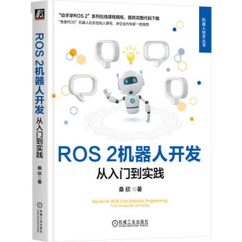

# ROS 2机器人开发：从入门到实践 书籍配套代码

机器人开发是一项复杂的系统工程，ROS 2为智能机器人开发提供了强有力的支持，极大地提高了机器人软件开发效率。本书首先对ROS 2的基础概念、通信机制、常用库和工具进行介绍，带领读者入门ROS 2机器人开发；接着引导读者完成移动机器人的建模和仿真、建图和导航、自定义控制器和规划器等一系列实践；然后在真机实战环节，通过制作一个基于ROS 2的真实机器人，帮助读者打通仿真与真机之间的壁垒；最后，本书深入讲解了ROS 2进阶使用的相关知识，为读者进一步在实战中使用ROS 2进行机器人开发打下夯实基础。考虑读者基础，书中示例均以C++和Python两种语言实现，同时加入了关于C++新特性、Git工具、多线程和回调函数等基础知识的讲解。

## 配套代码介绍

本项目为ROS 2机器人开发：从入门到实践 书籍配套代码，包含ROS 2机器人开发相关的示例代码。

## 作者

- [小鱼](https://github.com/fishros)